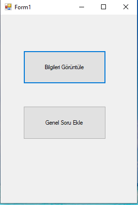

# 🚀 The goal of the project

A [quiz app](https://github.com/mwlt68/Quiz_Game) will be developed for android. The question pool of this application needs to be constantly updated by another user. It is a difficult task for the user to manipulate the json file directly. In order to do it in an easier way, the user will be able to add, edit and remove new questions, thanks to this developed form application. Later, this json file will be added to the android application and run. Since the user is Turkish, the user interface is in Turkish.

# Project Features

- The main form is met when the user is run. This is to show form information and preemptively add questions to forms.
- The user can see data about all existing questions.
- You can search within the questions.
- Can delete any question.
- Can add a new question.
- When the form is closed, the backup of the questions is saved.

# Project Images

